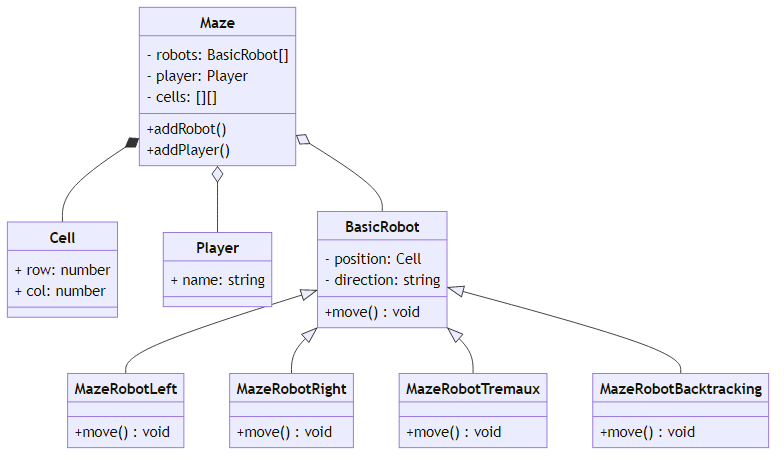

# Wap Maze Robots
## Pohyb robotů v bludišti na webovém plátně

Dostupné na https://jkotoun.github.io/WAP_Maze-robots/

Vygenerování programové dokumentace - npm install && npm run doc
Spuštění programu pouze otevřením index.html v prohlížeči
Ovládání:
- Kliknutím na Generate se vygeneruje bludiště dle nastavení
- WASD pro pohyb hráče - cílem je se dostat na zelené políčko (cíl)
- Kliknutím levým tlačítkem myši je do bludiště na danou pozici umístěn robot hledající cíl, který pracuje dle určité strategie a určitou rychlostí dle volby v bočním panelu

## Informace k řešení

### Generování bludiště
Generování bludiště je implementováno pomocí algoritmu Recursive division method[https://en.wikipedia.org/wiki/Maze_generation_algorithm#Recursive_division_method]. Algoritmus funguje na základě postupného řezání bludiště na komory(čtvrtiny). Náhodně se vybere sloupec a řádek v nadřazené komoře. Tyto dvě informace rozhodnou kde se aktuální komora předělí zdí. Do zdi jsou následně přidány minimálně tři dveře, aby se zajistila dostupnost všech čtyř komor. V případě, že chceme generovat smyčky v bludišti, tak stačí přidat náhodné generování počtu dveří. V našem případě jsou to 3-4 dveře. Řezání komor je implementováno jako rekurzivní fukce, kde se na každou ze čtyř nově vygenerovaných komor zavolá ta samá funkce.

### Implementované strategie pohybu robotů
Základní strategií je náhodný pohyb robota po bludišti. Pokročilejšími strategiemi je poté pravidlo levé ruky (robot se drží levé stěny), pravidlo pravé ruky (robot se drží pravé stěny), backtracking (prohledávání do hloubky, kde uzly představují křižovatky, kde je možné prozkoumat alternativní cestu). Nejpokročilejší strategií je Tremauxův algoritmus, který zvládne řešit i bludiště s cykly. 

### Návrh

#### Třída `Maze`
Třída `Maze` slouží pro reprezentaci celého bludiště. Skládá se z pole instancí třídy `Cell`, která reprezentuje jednu buňku. Dále může obsahovat hráče a pole robotů, kteří se po bludišti pohybují. Obsahuje také metody pro vygenerování bludiště, jeho vykreslení a pomocné metody pro zjištění informací o bludišti, např. jestli je v dané buňce v určitém směru umístěna zeď.

#### Třída `Cell`
Obsahuje informaci o jedné buňce - tedy především její polohu v bludišti, zda je cílová a jaké obsahuje stěny.

#### Třídy robotů
Robot je buď základního typu (`MazeRobotBasic`), který náhodně prochází bludiště a nebo některý s pokročilejší strategií průchodu (`MazeRobotRight`, `MazeRobotLeft`, `MazeRobotTremaux` a `MazeRobotBacktracking`). Pokročilejší roboti dědí ze základního robota a redefinují chování funkce move, která na základě vnitřního stavu robota určí polohu v bludišti pro následující krok simulace. Dále roboti obsahují informace jako je jejich ikona, aktuální poloha v bludišti a další pomocné informace a metody pro strategii hledání cíle.

#### Třída `Player`
Základ je stejný jako základní robot, ale ovládání není řízeno strategií pohybu, ale přímo uživatelem pomocí šipek

#### Propojení a ostatní části projektu
Řízení simulace je umístěno v souboru `Main.js`, který definuje různé event listenery a řídí kroky simulace v uživatelem zvolených intervalech. Dále je v projektu soubor `Helpers.js`, který obsahuje aktuálně pouze 1 pomocnou funkci pro generování čísel ze zvoleného rozsahu. Vstupním bodem projektu je soubor `index.html`, kde je definována struktura stránky a kde jsou do stránky vloženy javscriptové soubory a styly (`style.css`). Ikony robotů jsou uloženy ve složce `/img`.

  
## Znázornění objektového návrhu diagramem tříd

